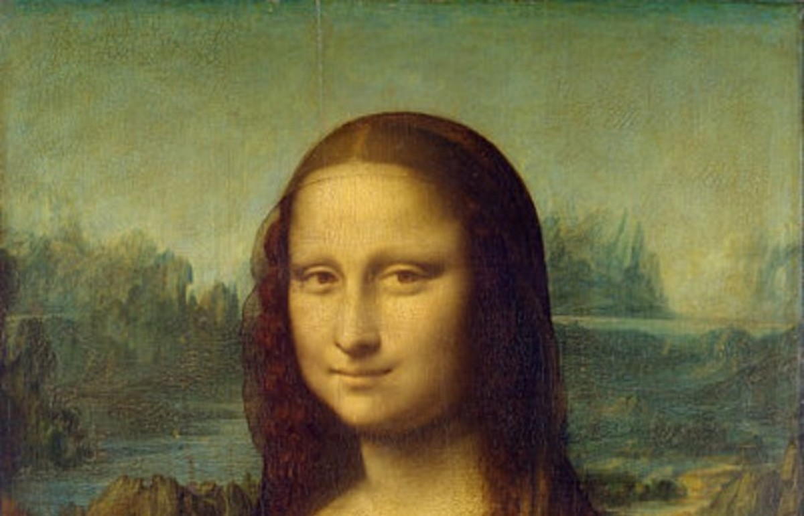
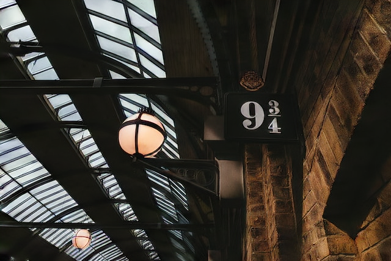

# RoSteALS
  


Official implementation of [RoSteALS: Robust Steganography using Autoencoder Latent Space](https://arxiv.org/abs/2304.03400).

Update: our model is now live on [HuggingFace](https://huggingface.co/spaces/tubui/rosteal).

### Environment

We tested with pytorch 1.11, torchvision 0.12 and cuda 11.3, but other pytorch versions probably work as well. To reproduce the environment, please check [dependencies](dependencies).

# Inference example
Run the following script to download our 100-bit RoSteALS pretrained model checkpoint (520MB). It also downloads the frozen vq-f4 autoencoder necessary if you want to train your own model later:

```
bash download_models.sh
```
The checkpoint and the frozen autoencoder  will be stored at `models/RoSteALS/epoch=000017-step=000449999.ckpt` and `models/first_stage_models/vq-f4/model.ckpt` respectively.

To embed a secret text to an image:
```
python inference.py --config models/VQ4_mir_inference.yaml --weight models/RoSteALS/epoch=000017-step=000449999.ckpt --secret Secrets --cover examples/monalisa.jpg --output examples/monalisa_secrets.png
```

We use BCH Error Code Correction which costs 40 bits of our 100-bit payload, thus the secret text should not exceed 7 characters (or 8 ASCII characters, as demonstrated in our live demo above). 

You should get the results like this:
Cover | Stego | Resolution | Secret text
:---:| :---: |:---: | :---:
 |  | 1200x771| secrets
 |  | 640x427| Harry
 |  | 1920x1325 |Braies


# Train your own model
## Data Preparation
To prepare data, you will need to provide path to the image directory and a list containing the relative paths of all training images. These paths are configured at [models/VQ4_mir.yaml](models/VQ4_mir.yaml).

To replicate our model, you can download the MIRFlickR dataset from their official website. We only use 100k images so downloading the [first tar file](https://press.liacs.nl/mirflickr/mirflickr1m.v3b/images0.zip) is enough. For completness, we enclose the train and validation lists at [prep_data/mir_train2.csv](prep_data/mir_train2.csv) and  [prep_data/mir_val2.csv](prep_data/mir_val2.csv) respectively.

## Train
```
python train.py --config models/VQ4_mir.yaml --secret_len 100 --max_image_weight_ratio 10 --batch_size 4 -o saved_models

```
where batch_size=4 is enough to fit a 12GB GPU; adjust the `max_image_weight_ratio` parameter to control the trade-off between stego quality and secret recovery performance (lower value means lower stego quality but higher secret recovery, please check Fig.8 in our paper for more details).

Please note that all images will be resized to 256x256 during training (to match with the vq-f4 autoencoder), but our [inference](inference.py) script supports embedding at an arbitrary resolution.


# Acknowledgement
The code is inspired from [Stable Diffusion](https://github.com/CompVis/stable-diffusion) and [ControlNet](https://github.com/lllyasviel/ControlNet). 


# Citation
```
@InProceedings{bui2023rosteals,
  title={RoSteALS: Robust Steganography using Autoencoder Latent Space},
  author={Bui, Tu and Agarwal, Shruti and Yu, Ning and Collomosse, John},
  booktitle = {Proc. CVPR WMF},
  year={2023}
}
```
