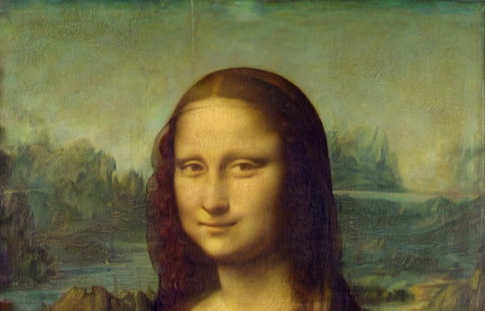

# RoSteALS
  


Official implementation of [RoSteALS: Robust Steganography using Autoencoder Latent Space](https://arxiv.org/abs/2304.03400).

### Environment

We tested with pytorch 1.11, torchvision 0.12 and cuda 11.3, but other pytorch versions probably work as well. To reproduce the environment, please check [dependencies](dependencies).

# Inference example
Run the following script to download our 100-bit RoSteALS pretrained model checkpoint (520MB). It also downloads the frozen VQVAE autoencoder necessary if you want to train your own model later:

```
bash download_models.sh
```
The checkpoint and the frozen autoencoder  will be stored at `models/RoSteALS/epoch=000017-step=000449999.ckpt` and `models/first_stage_models/vq-f4/model.ckpt` respectively.

To embed a secret text to an image:
```
python inference.py --config models/VQ4_mir_inference.yaml --weight models/RoSteALS/epoch=000017-step=000449999.ckpt --secret Secrets --cover examples/monalisa.jpg --output examples/monalisa_secrets.png
```

We use BCH Error Code Correction which costs 40 bits of our 100-bit payload, thus the secret text should not exceed 7 characters. 

You should get the results like this:
Cover | Stego | Resolution | Secret text
:---:| :---: |:---: | :---:
 |  | 1200x771| secrets
 |  | 640x427| Harry
 |  | 1920x1325 |Braies


# Train your own model
## Data Preparation
TODO: instructions to download and prepare the MIRFlickR dataset.

Update the data path in the config file at [models/VQ4_mir.yaml](models/VQ4_mir.yaml).

## Train
```
python train.py --config models/VQ4_mir.yaml --secret_len 100 --max_image_weight_ratio 10 --batch_size 4 -o saved_models

```
where batch_size=4 is enough to fit a 24GB GPU.


# Acknowledgement
The code is inspired from [Stable Diffusion](https://github.com/CompVis/stable-diffusion) and [ControlNet](https://github.com/lllyasviel/ControlNet). 


# Citation
```
@InProceedings{bui2023rosteals,
  title={RoSteALS: Robust Steganography using Autoencoder Latent Space},
  author={Bui, Tu and Agarwal, Shruti and Yu, Ning and Collomosse, John},
  booktitle = {Proc. CVPR WMF},
  year={2023}
}
```
